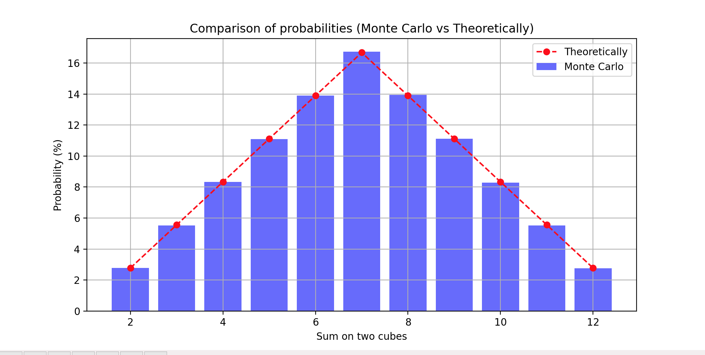

# algo-fp

## Task 7: Monte Carlo Simulation of Dice Rolls

### Description

This task involves simulating the rolling of two six-sided dice using a Monte Carlo method. The goal is to compare the probabilities of the sums obtained from the simulation with the theoretical probabilities.

### Code

The code for this task is in the `task7.py` file. It performs the following steps:

1. Simulates rolling two dice a specified number of times.
2. Counts the occurrences of each possible sum (from 2 to 12).
3. Calculates the Monte Carlo probabilities based on the simulation results.
4. Compares the Monte Carlo probabilities with the theoretical probabilities.
5. Plots a bar chart and a line graph to visualize the comparison.

### Results

The results of the simulation and the theoretical probabilities are as follows:

```
Sum | Monte Carlo (%) | Theoretically (%)
-----------------------------------
2   | 2.80            | 2.78
3   | 5.52            | 5.56
4   | 8.33            | 8.33
5   | 11.10           | 11.11
6   | 13.91           | 13.89
7   | 16.73           | 16.67
8   | 13.94           | 13.89
9   | 11.12           | 11.11
10  | 8.27            | 8.33
11  | 5.53            | 5.56
12  | 2.76            | 2.78
```

### Conclusion

The Monte Carlo simulation results closely match the theoretical probabilities. This demonstrates that the Monte Carlo method is effective for approximating the probabilities of sums obtained from rolling two dice. The slight differences between the simulated and theoretical probabilities are due to the randomness inherent in the simulation process.

### Visualization

The following plot compares the Monte Carlo probabilities with the theoretical probabilities:


### How to Run

To run the simulation and generate the plot, follow these steps:

1. Ensure you have Python installed on your system.
2. Install the required packages using the following command:

```sh
pip install matplotlib
```

3. Run the `task7.py` script:

```sh
python task7.py
```

This will output the comparison of probabilities and display the plot.

### License

This project is licensed under the MIT License.
